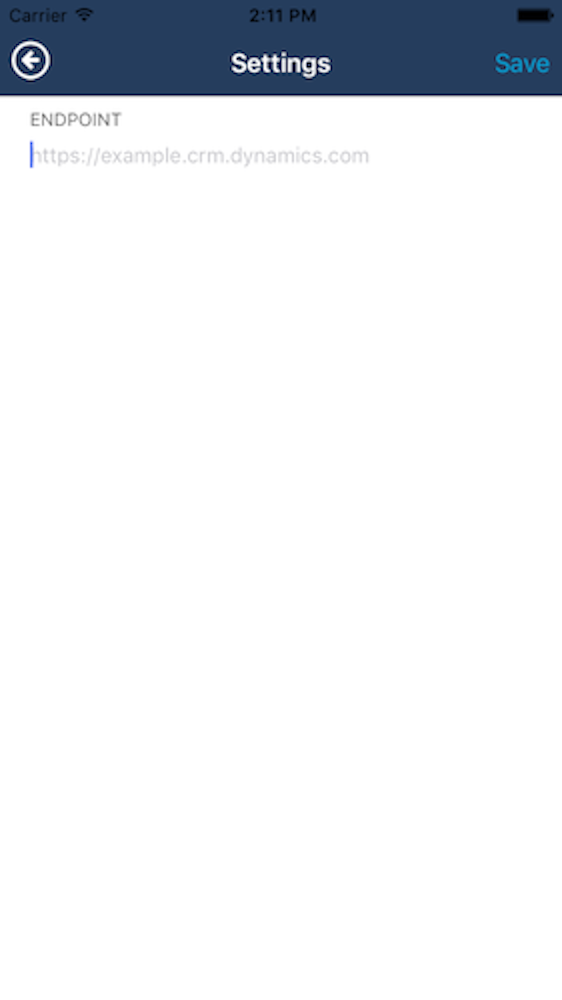
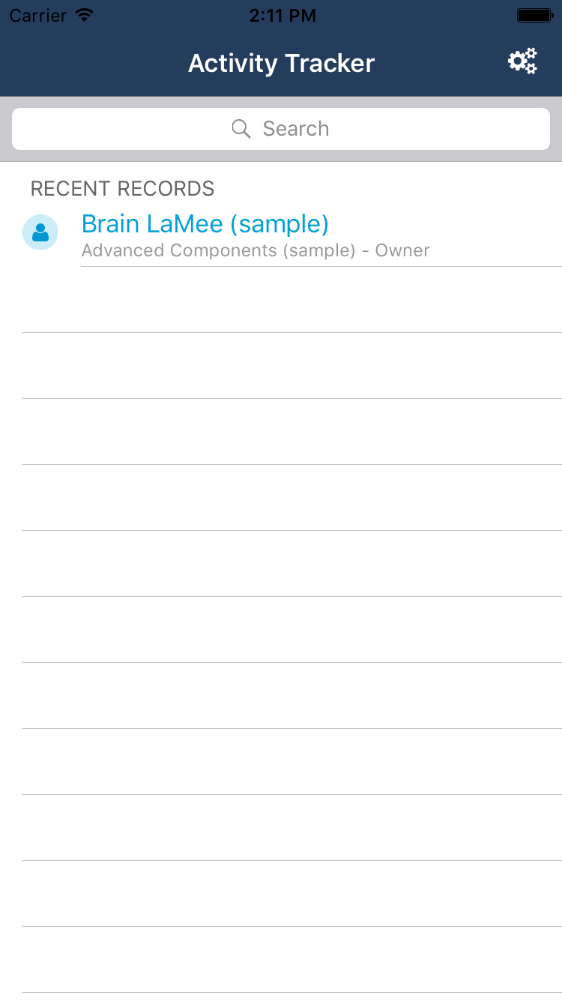
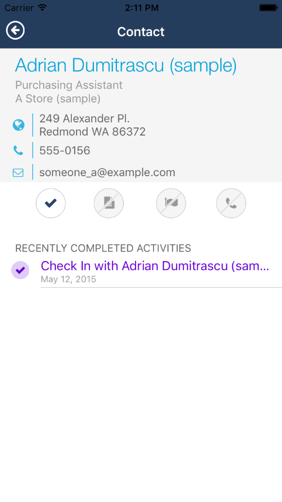
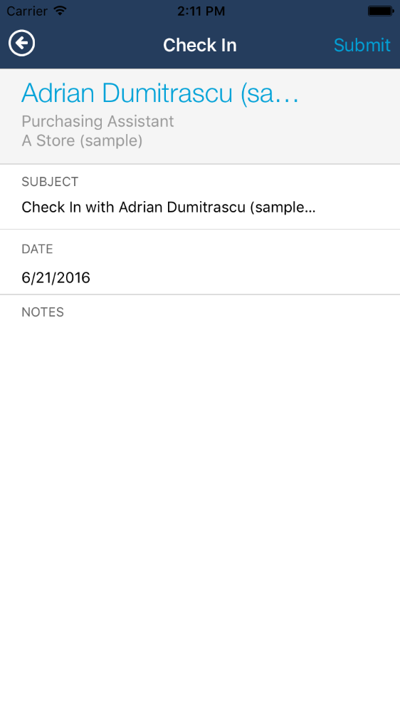

# Activity Tracker #

The Activity Tracker sample demonstrates how to write a working iOS/Swift application that can access Microsoft Dynamics CRM 2016 business data by using the CRM Web API.  When run, the sample allows you to query contacts and add a quick activity record related to a contact.  Use this sample code as a starting point to build a more complete application, or refer to it when building a new project. 

## Prerequisites ##
1.  This code sample targets an iPhone running iOS 9 or later and XCode 7.3 or later
2.	Your CRM instance must be running Dynamics CRM 2016 or later.
3.  Your CRM instance must be configured for OAuth authentication.
4.  This application requires [Cocoapods](https://cocoapods.org) to add the required ADAL (Azure Active Directory Authentication Library) module.

## Quick Start ##
1. Ensure your Active Directory setup meets the prerequisites listed on [MSDN](http://msdn.microsoft.com/en-us/library/dn531010.aspx).
2. Follow the steps in that article to register a new application with Azure Active Directory.
	If you are using an IFD/On-premises instance, ensure that you run the Powershell commands from the above article.
3. In a terminal window, navigate to the folder containing the PodFile.  Run the commands 'pod setup' and then 'pod install' to add ADAL to the project.
4. Modify the values of these two constants in the Activity Tracker/CRMConnector/CRMClient.swift file. You obtain these values from when you registered an application in the Azure portal.

    var CLIENT_ID: String { get {return "1dc3cd16-85f4-449e-9145-98c996ea6a85";}}

    var REDIRECT_URI: String { get { return "http://crm.codesamples/";}}"
    
5. Build and run the Activity Tracker application.
6. On the settings screen of the app, type your CRM organization URL and select **Save**.  You will be prompted to logon to your Dynamics CRM organization.
7. After logon, start searching for contacts by entering one or more letters in the search box.

## CRM Connector ##
The classes in this folder are responsible for communicating with CRM, parsing the results, and storing recent records.  The CRMClient class leverages the CRM Web API.

You should register a new app ID with Microsoft Azure AD and replace these constants in CRMClient.swift with the clientID and redirect URL you choose.  Relevent instructions can be found on [MSDN](http://msdn.microsoft.com/en-us/library/dn531010.aspx).

    var CLIENT_ID: String { get {return "1dc3cd16-85f4-449e-9145-98c996ea6a85";}}

    var REDIRECT_URI: String { get { return "http://crm.codesamples/";}}"
	
The CRMClient class uses generic error handlers.  You may want to expand on these and include more specific messages for your environment.

### Local Storage ###
This class handles storing the recently viewed records and the current CRM organization URL that is being used.  The class uses NSUserDefaults to store that information.  If you are creating an app that is going to store information for offline use, you should leverage other storage options such as Core Data.  This sample focuses on the interaction with CRM and is not intended to be a sample showing the other storage options.

## Objects ##
The CRMObject class is the base class that defines the methods and properties that are common to all objects.

The CRMContact class handles all instances of contacts that will be shown in the application.  This class also starts to parse the contact's related activities list.

The CRMActivity class handles both the recently completed activities related to a contact and the new activity records that can be created in this app.

## Views ##

### Settings View ###
<table>
<tr>
<td width="50%">
Unless you choose to hardcode an endpoint URL, you will want to display the settings page to the user on first launch.  The settings view allows the user to enter their CRM server URL and then begins the authentication process.
</td>
<td>

</td>
</tr>
</table>
        
### Home View ###
<table>
<tr>
<td width="50%">
This view allows you to access the records you have recently viewed or search for other records.
</td>
<td>

</td>
</tr>
</table>

### Object Details View ###
<table>
<tr>
<td width="50%">
This view shows more details about the selected contact including recently completed records.  The view also allows you to launch into a new completed task form.
</td>
<td>

</td>
</tr>
</table>

### New Activity View ###
<table>
<tr>
<td width="50%">
This view allows you to create a completed task related to the selected contact.  You can edit the subject, date, and add notes.  When submitting, the task is created in CRM, and then marked completed.
</td>
<td>

</td>
</tr>
</table>

### UI Styling ###
There is a file called ColorsAndFonts that defines the colors that are used throughout this application.  You can tweak the colors in the application or add new colors and use them to skin the application to suit your needs.

## Class Categories ##
There is a class category in this folder on NSString.  The StringFormatting category is used to ensure there is always something displayed in the UI where a string should be.